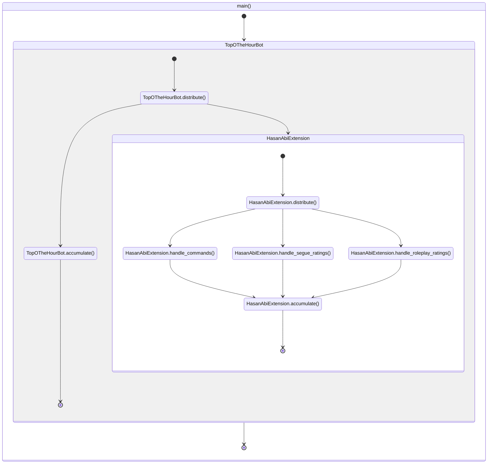

# Contributing

Heyyo! If you're reading this, then that means you're thinking about making a contribution - that's great!

If you're **not familiar** with programming, you can create an [issue](https://github.com/TopOTheHourBot/TopOTheHourBot/issues) to describe your idea. If I like your idea, I will develop the implementation and grant you credit in this repository's [README](./README.md). If you don't want to create a GitHub account, feel free to message me (@Lyystra) in chat - I'm typically in [Hasan](https://www.twitch.tv/hasanabi)'s, [Will](https://www.twitch.tv/willneff)'s, or [Jerma](https://www.twitch.tv/jerma985)'s.

If you're **familiar** with programming, the rest of this document is dedicated to getting you up-to-speed on how TopOTheHourBot works and where in the code to construct new features. You'll of course be given credit in the repository's [README](./README.md) if your contributions are merged.

## Agreements

In general, if you're thinking about making a contribution that interacts with non-privileged chatters (chatters that are not moderators, VIPs, or Hasan) in some manner, **I will be seeking approval from Hasan's moderators first**. This wasn't an explicit requirement given to me by them, but I'd very much prefer if this was done so as to ensure that the feature doesn't come into conflict with their expectations of chat.

Certain features will **always** be denied even though they do not go against [Twitch's Developer Agreement](https://www.twitch.tv/p/en/legal/developer-agreement/) - these are my own rules on what is and is not allowed. Please do not ask for or create features that perform the following operations:

1. Persistently collects user-associated data, regardless of ephemerality.
    1. Persistence is referring to the state of existence between sessions of execution. User-associated data may only be collected in the execution state - all collections must be discarded when the session ends.
    2. User-associated data is specifically referring to content generated by, and mapped to the user in a manner such that the content could be tied back to the user.
        1. This includes collection of user names, as the collection itself would be the "content" in question. A list of users that have sent X emote in the past 30 days, for example, still encodes information about the users even if emote X was not stored with them - it might be the task of the list's user to re-construct emote X for themselves.
    3. Persistent collection of user-associated data is only permitted if the user, themself, encoded user-associated data within an otherwise non-user-associated storage interface.
        1. An example of this would be a command that logs its arguments to a local file, where the user has invoked the command with user-associated data as argument(s).
        2. If such a circumstance is possible, it should be stated in the interface.
2. Grants non-privileged chatters the ability to spam messages, regardless of its compliance to Twitch Terms of Service, through the TopOTheHourBot client.
    1. This is specifically referring to "deliberate spam" - a feature that is knowingly making an attempt to send messages at an abnormally fast rate. "Accidental spam" is permitted - e.g., a command, ad segue, and a roleplay moment could all occur simultaneously and trigger the client to send three messages at once - the individual components did not attempt to spam, themselves, and so it is permissible.
    2. There is no concrete definition of "spam". In general, I consider it to be any routine that sends a lot of messages in a short timeframe - it is an "I know it when I see it" kind of thing, and so the wording with regards to this rule is deliberately vague.

TopOTheHourBot is, and will always be open source. All code contributions will be subject to the [MIT license](./LICENSE).

## High Level Overview

One of the first things you'll probably notice upon seeing TopOTheHourBot's code is the lack of `on_message()`, `on_connect()`, `on_whatever()` functions that are prevalent in many IRC libraries today. TopOTheHourBot is a bit quirky, in that, its most fundamental operation of averaging bulk segue ratings requires two things that are awkward to implement in traditional callback-based paradigms:

1. Averaging a multitude of numbers requires knowledge of the numbers that came before, meaning that a state must be managed in the outer scope.
2. Reporting the average is based on a factor of time, meaning that the callback must have knowledge over when it has last been invoked.

TopOTheHourBot's new paradigm addresses this awkwardness with an API built on the concept of attaching and detaching buffers to a central object. This object fans messages out to each buffer, while the buffer provides tools to handle filtering, mapping, timeouts, etc. such that states and time between a cluster of messages can be managed within a single function.

To showcase the difference this makes, suppose that our goal is count the number of messages that contain the string `"hello"` - in a callback-based framework, this count must exist in the outer scope to "remember" what the prior count was:

```python
class Listener:

    def __init__(self) -> None:
        self.hello_count = 0

    async def on_message(self, message: Message) -> None:
        if "hello" in message.content:
            self.hello_count += 1
```

Under the new paradigm, this count can be restricted to the scope of a single function, allowing us to avoid cluttering the outer scope:

```python
class Listener:

    def __init__(self) -> None:
        ...

    async def hello_counter(self) -> int:
        with self.attachment() as channel:
            hello_count = await (
                aiter(channel)
                    .map(lambda message: message.content)
                    .filter(lambda content: "hello" in content)
                    .count()
            )
        return hello_count
```

While not particularly egregious, imagine a scenario where you have a multitude of variables that need to be defined in a similar fashion - all having to exist in the outer scope while potentially serving vastly different purposes.

## Low Level Overview


