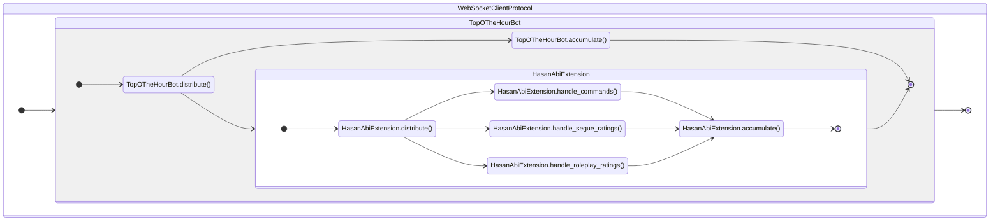

# Contributing

Heyyo! If you're reading this, then that means you're thinking about making a contribution - that's great!

If you're **not familiar** with programming, you can create an [issue](https://github.com/TopOTheHourBot/TopOTheHourBot/issues) to describe your idea. If I like your idea, I will develop the implementation and grant you credit in this repository's [README](./README.md). If you don't want to create a GitHub account, feel free to message me (@Lyystra) in chat - I'm typically in [Hasan](https://www.twitch.tv/hasanabi)'s, [Will](https://www.twitch.tv/willneff)'s, or [Jerma](https://www.twitch.tv/jerma985)'s.

If you're **familiar** with programming, the rest of this document is dedicated to getting you up-to-speed on how TopOTheHourBot works and where in the code to construct new features. You'll of course be given credit in the repository's [README](./README.md) if your contributions are merged.

## Agreements

In general, if you're thinking about making a contribution that interacts with non-privileged chatters (chatters that are not moderators, VIPs, or Hasan) in some manner, **I will be seeking approval from Hasan's moderators first**. This wasn't an explicit requirement given to me by them, but I'd very much prefer if this was done so as to ensure the feature doesn't come into conflict with their expectations of chat.

Certain features will **always** be denied even though they do not necessarily violate [Twitch's Developer Agreement](https://www.twitch.tv/p/en/legal/developer-agreement/) - these are my own rules on what is and is not allowed. Please do not ask for or create features that perform the following operations:

1. Persistently collects user-associated data, regardless of ephemerality.
    1. Persistence is referring to the state of existence between sessions of execution. User-associated data may only be collected in the execution state - all collections must be discarded when the session ends.
    2. This includes basic collection of user names, even if they are not mapped to pieces of data. The collection itself holds meaning.
    3. Persistent collection of user-associated data is only permitted if the user, themself, encoded user-associated data within an otherwise non-user-associated storage interface.
        1. An example of this would be a command that logs its arguments to a local file, where the user has invoked the command with user-associated data as argument(s).
        2. If such a circumstance is possible, it should be stated in the interface.
2. Grants non-privileged chatters the ability to spam messages, regardless of its compliance to Twitch Terms of Service, through the TopOTheHourBot client.
    1. This is specifically referring to "deliberate spam" - a feature that is knowingly making an attempt to send messages at an abnormally fast rate. "Accidental spam" is permitted - e.g., a command, ad segue, and a roleplay moment could all occur simultaneously and trigger the client to send three messages at once - the individual components did not attempt to spam, themselves, and so it is permissible.
    2. There is no concrete definition of "spam". In general, I consider it to be any routine that sends a lot of messages in a short timeframe - it is an "I know it when I see it" kind of thing, and so the wording with regards to this rule is deliberately vague.

TopOTheHourBot is, and will always be open source. All code contributions will be subject to the [MIT license](./LICENSE).

## Getting Started

TopOTheHourBot is written in Python 3.12. Twitch chats, and especially Hasan's chat, can be extremely fast and so you might wonder why Python was the language of choice. There isn't really a satisfying answer to that, other than I just know Python better than any other language, and it's more than capable to handle the speed of Hasan's chat. Python can certainly be slow, but recent versions of the language have made great strides to speed it up. Keep in mind that a vast majority of chat messages are single words - often, emotes (e.g., KEKW, FeelsStrongMan, Bedge) - and so processing messages takes a lot less time than you might think.

TopOTheHourBot uses an API that was built almost entirely from scratch. For a long time, the bot was implemented using [TwitchIO](https://twitchio.dev/en/stable/), but I slowly became annoyed with its callback-dependent nature and tendency to have connection issues. There are three libraries that comprise TopOTheHourBot's API, two of which were built specifically for TopOTheHourBot and are not available through PyPI (installation instructions are in their respective READMEs):
- [`ircv3`](https://github.com/TopOTheHourBot/ircv3)
- [`channels`](https://github.com/TopOTheHourBot/channels)
- [`websockets`](https://websockets.readthedocs.io/en/stable/)

My personal development setup uses [Visual Studio Code](https://code.visualstudio.com/) with [Pylance](https://marketplace.visualstudio.com/items?itemName=ms-python.vscode-pylance) (using the `"basic"` type-checking option). TopOTheHourBot provides [a CLI](./main.py) that I recommend using in a debug configuration (your local .vscode/launch.json file):

```json
{
    "version": "0.2.0",
    "configurations": [
        {
            "name": "TopOTheHourBot",
            "type": "python",
            "request": "launch",
            "program": "main.py",
            "args": [YOUR_TWITCH_OAUTH_TOKEN_HERE],
            "console": "integratedTerminal",
            "justMyCode": true
        }
    ]
}
```

You'll of course need a Twitch OAuth token to have this run successfully. See the [Twitch Developers documentation](https://dev.twitch.tv/docs/irc/authenticate-bot/) for details on generating one. To execute TopOTheHourBot's code under a different client, you'll want to change the `name` attribute at the top of the `TopOTheHourBot` class definition to the name of your bot's client. Likewise, to run the `HasanAbiExtension` in a different channel, you'll want to change the `target` attribute at the top of its definition to the name of the channel you'd like to have it execute in (bear in mind that the leading `#` character is necessary).

You might also want to consider changing the logging level in [main.py](./main.py) from `INFO` to `DEBUG`. Doing so will write all input and output to the log - see the [websockets documentation](https://websockets.readthedocs.io/en/stable/topics/logging.html) for more details.

## Where Are The Callbacks?

One of the first things you'll probably notice upon seeing TopOTheHourBot's code is the lack of `on_message()`, `on_connect()`, `on_whatever()` functions that are prevalent in many IRC libraries today. TopOTheHourBot is a bit quirky, in that, its most fundamental operation of averaging batch segue ratings requires two things that are awkward to implement in traditional callback-based paradigms:

1. Averaging numbers across messages requires memory of those numbers, meaning that a state must be saved across invocations to the message callback.
2. Reporting the average is based on a factor of time, meaning that the callback must have knowledge over when it has last been invoked.

TopOTheHourBot has its own paradigm that makes an attempt to address these issues. The API it uses is built on the concept of attaching and detaching buffers (called `Channel`s) to a central object. This object fans messages out to each buffer, while the buffer provides tools to handle filtering, mapping, timeouts, etc. such that states and time between a cluster of messages can be managed within a single function.

Suppose that our goal is to count the number of messages that contain the string `"hello"` - in a callback-based framework, this count must exist in the outer scope to "remember" what the prior count was:

```python
class Listener:

    def __init__(self) -> None:
        self.hello_count = 0

    async def on_message(self, message: Message) -> None:
        if "hello" in message.content:
            self.hello_count += 1
```

Under the TopOTheHourBot paradigm, this count can be restricted to the scope of a single function, allowing us to avoid cluttering the outer scope:

```python
class Listener:

    def __init__(self) -> None:
        ...

    async def hello_counter(self) -> int:
        with self.attachment() as channel:
            hello_count = await (
                aiter(channel)
                    .map(lambda message: message.content)
                    .filter(lambda content: "hello" in content)
                    .count()
            )
        return hello_count
```

While not particularly egregious, imagine a scenario where you have a multitude of variables that need to be defined in a similar fashion - each having to exist in the outer scope while potentially serving vastly different purposes - and you'll probably see the reason why TopOTheHourBot does things so differently (it just becomes a mess).

## Architecture

With all of that said, let's finally take a look at how the TopOTheHourBot implementation uses this concept to full effect.

You can really think of TopOTheHourBot as being a large [fan-out/fan-in](https://en.wikipedia.org/wiki/Fan-out_(software)) system. In the code, there is a `TopOTheHourBot` client class, and a `HasanAbiExtension` "client extension" class. `TopOTheHourBot`, by itself, does not do much at all - its sole job is to respond to [PINGs](https://modern.ircdocs.horse/#ping-message), and distribute incoming commands to its attachments. `HasanAbiExtension` is where much of the actual work is being done. While seemingly unnecessary, this apportioning of Hasan-specific operations was done in case the bot ever obtains capabilities in other channels - it's a future-proofing measure. The diagram, below, shows the flow of messages from the underlying websocket connection to this system:[^1]



`TopOTheHourBot` does not, by itself, house any responsive functionality other than to reply to PINGs, as stated prior. This is done in its `accumulate()` method, and thus does not have `handle_*()` methods alike `HasanAbiExtension`.

`HasanAbiExtension` gets a bit more involved - its `distribute()` method attaches a channel to `TopOTheHourBot` on startup, and filters for Hasan-localised commands. These commands are then served to `handle_commands()`, `handle_segue_ratings()`, and `handle_roleplay_ratings()` which all are fairly self-explanatory. Each of these `handle_*()` methods attach a channel to the `HasanAbiExtension` instance and independently read incoming messages for their own purpose - `handle_commands()` responds to traditional call-and-respond commands[^2], `handle_segue_ratings()` searches and averages ad segue ratings, and `handle_roleplay_ratings()` searches and summarises roleplay ratings. These message handlers are asynchronous iterators that yield coroutines - `accumulate()` runs each of them together and dispatches these coroutines as they are yielded.

## Building a Feature

Okay, so hopefully this high-level overview has made some kind of sense - I'll now be getting into the actual code. Instead of just showing you the code and talking about it, I think it'd be best to develop an example feature and talk about what I'm doing as I progress. It's likely that you'll want to contribute a feature that is a part of the `HasanAbiExtension`, and so we'll do something there (just not running it in Hasan's chat, though).

The feature we'll be creating is something that's difficult to replicate in a callback-based paradigm, but made incredibly easy in TopOTheHourBot's - that being a "conversational" routine, where the client sends a message and expects another message in return.

We'll have it work like this:
1. If a chatter types "topothehourbot is cringe", the client will say to the chatter to take it back.
2. The client will await the chatter's next message with a timeout, and respond accordingly based on the message's content (or, lack thereof if a timeout occurs).

https://github.com/TopOTheHourBot/TopOTheHourBot/assets/53410383/ed558c7b-dee2-40c7-8d5e-e7f3614e3571

### Before Building

Before you begin modifying the `HasanAbiExtension`, or any other extension type for that matter, **I would first change the `target` attribute at the top of the definition to be a different chat room, such as your own**. It's a lot easier to test that way, and of course doesn't bother any mods.

### Placement

When considering a new feature, think about where it would best be placed under TopOTheHourBot's architecture. Certain features, like the one we're constructing now, requires that we yield a message and await another one in return from a specific chatter - these kinds of situations are often best formulated as another "`handle_something()`" function because we're dealing with cross-message states: the chatter who initially called the bot cringe needs to be saved such that we can filter for them at a later moment in time. Handling cross-message states is the entire reason why TopOTheHourBot has its own API.

If your feature is a "fire-and-forget" style of routine, such as a command, it's likely that a new handler isn't necessary. Factor out commonalities to see if the feature could be put under an existing handler - a handler for every command, for example, would duplicate a lot of work and so all commands are put under `handle_commands()`.

### Starting Off

We'll start off with what is essentially boilerplate for all handler functions. We'll call our function `handle_haters()`:

```python
@stream.compose
async def handle_haters(self) -> AsyncIterator[Coroutine]:
    with self.attachment() as channel:
        ...
```

`stream.compose()` is a decorator function that simply converts an asynchronous iterator or generator into a [`Stream`](https://github.com/TopOTheHourBot/channels/blob/main/channels/stream.py) object. This is atop all handler functions for use by `accumulate()`, which uses the `Stream.merge()` method to collect coroutines yielded by the handlers.

The `with self.attachment() as channel:` statement will create, attach, and ensure the detachment of a [`Channel`](https://github.com/TopOTheHourBot/channels/blob/main/channels/channel.py) instance connected to the `HasanAbiExtension`'s [`Diverter`](https://github.com/TopOTheHourBot/channels/blob/main/channels/diverter.py). The `Diverter` is what manages the "spread" of commands and closure to each handling function - the `attachment()` method of the `HasanAbiExtension` is really just a call to `Diverter.attachment()`.

When `HasanAbiExtension.distribute()` is executed, commands from the IRC server are distributed through the diverter as they arrive. If the connection ever ceases for some reason, the diverter is closed and all channels that were attached cease iteration. Under most circumstances, the diverter will detach the channels by itself, causing the `attachment()` context managers to essentially take no action upon exit. One might say that its "true" purpose is in dealing with coroutines that exit prematurely, but I have not yet found a situation where a premature exit is wanted or needed. Regardless, I advise using `attachment()` to construct and attach new channels when necessary.

### Querying the Haters

The next step that we'll take is to search for chatters that are saying TopOTheHourBot is cringe. We want the conversation to be repeatable, and so we'll query for the infringing remark in a loop:

```python
@stream.compose
async def handle_haters(self) -> AsyncIterator[Coroutine]:
    with self.attachment() as channel:
        while (
            message := await aiter(channel)
                .filter(twitch.is_server_private_message)
                .filter(lambda message: "topothehourbot is cringe" in message.comment)
                .first()
        ):
            hater = message.sender
```

You'll notice this among a lot of message handlers: one of the first things to do is filter the channel for private messsages, as the channel may contain other commands. [PRIVMSG](https://modern.ircdocs.horse/#privmsg-message) commands, as they're called for some reason, are simply normal chat messages.

The `Stream.first()` method being applied, here, obtains the first possible value from the filtered stream. If the stream is empty, then that can only mean the connection has been closed, and so it is okay to break our while loop by letting `Stream.first()` return `None`. Once obtaining a message with our criteria, we can save the chatter (the `message.sender`) as a state for later.

[^1]: Bear in mind that this diagram purely shows the flow of messages and not the relationship between classes. It may appear as if `TopOTheHourBot` composites `HasanAbiExtension`, for example, but it's actually the complete opposite - `HasanAbiExtension` composites `TopOTheHourBot`, and `TopOTheHourBot` composites `WebSocketClientProtocol`.

[^2]: Messages that invoke the client's command interface - typically implemented by pairing an identifying prefix to a command name (e.g., `#scramble` to begin a scramble game with BlammoBot). TopOTheHourBot uses the dollar sign, `$`, as its command prefix (chosen because of its association with ads - fun fact). `!` is used by Fossabot and `#` is used by BlammoBot.
