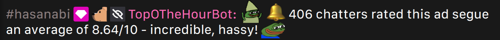

# TopOTheHourBot

TopOTheHourBot is a simple bot that only runs in HasanAbi's chat. It does one thing - that thing being to tally ad segue scores for an average.



The bot reads each incoming chat message searching for two items: an emote (DANKIES, PogO, or TomatoTime), and a score (a fraction whose denominator is 10, written vaguely like "X/10", where "X" can be any number).

The ordering of the emote and score does not matter, and the message may contain other content so long as the two things appear somewhere within the message. When such a message is first discovered, using an emote alongside a score becomes unnecessary - a message that contains a score alone will be counted towards the average.

## Further Details

Internally, the emote and score are referred to as the "key" and "value", respectively - these terms will be used throughout the remainder of this section.

When the bot is online, it spends most of its time searching for a message that contains *both* a key and value. When there is a message that fulfills this criteria, an averaging phase is started. When an averaging phase is active, the key is no longer required.

Values are internally kept as [floating point](https://en.wikipedia.org/wiki/Floating-point_arithmetic) numbers. When a value is matched, it is put onto a queue to be tallied by an averaging function that runs in the background. This averaging function continuously waits for values to be placed onto the queue in intervals of ~9.5 seconds (referred to as the "timeout"). When values can no longer be found, the waiting process ends, and the average is calculated from the values it had collected.

The bot will send a message that contains the average if there were at least 20 unique chatters that submitted a matchable value. The format of its message is, roughly:

```
DANKIES 🔔 <chatter count> rated this ad segue an average of <average score>/10 - <splash> <emote>
```

The `<splash>` and `<emote>` fields vary depending on how high/low the average was, and if the average was the highest it had seen during its runtime. There are 5 possible splash fields, and 12 possible emotes (6 positive and 6 negative).

## FAQ

### Can I submit multiple scores?

You can, yes. In prior iterations of the bot, you were unable to do so unless you had multiple accounts, but I ultimately decided that it'd be more fun if chatters could fight to skew the average in a certain direction.

### Can I submit a negative score? A score that's greater than 10? A decimal?

Yes, yes, and yes. Negative scores are treated as being equivalent to 0. Scores that are greater than 10 are treated as being equivalent to 10. In prior iterations of the bot, scores were not coerced to a value between 0 and 10 - this was an intentional design flaw to allow for funnier averages, but not many chatters recognized that negative values were also accepted (and thus, the average would always end up being extremely high - it wouldn't "balance out"). [This can be seen when Hasan first discovered the bot](https://clips.twitch.tv/ConfidentArtisticRutabagaKevinTurtle-LzPv2rHJROiM0bA_).

### Why does the bot chat normally sometimes?

The bot has some commands that are only usable by me and some friends. It used to have a command, called "$shadow", that would route whatever we're saying through the bot, without an indication that the message came from someone else. If you ever saw the bot chatting normally, it was one of us puppeteering it.

Twitch bots are also not like Discord bots - the user who created the bot's account may still login as the bot, and use the account as normal. This hasn't been done since the initial few days of the bot's deployment, however (there was one message sent in Hasan's chat, from me, that was done to test something).

### When does the bot run?

The bot will go online everyday at 2:00 PM Eastern (or, 11:00 AM Pacific in Hasan's time). It goes offline after 10 hours.

### Why is the bot's name pink?

It's a small homage to a friend of mine in chat, whose name also ends in "bot" (but isn't one).

### How is the bot ran?

The bot currently runs on a [DigitalOcean Droplet](https://www.digitalocean.com/products/droplets) that executes the main.py script from a [cron job](https://en.wikipedia.org/wiki/Cron).

The bot has been moved to many different locations, however, and is likely to change again in the future.

### Why did the bot not send out a message at [some moment in time]?

The bot unfortunately suffers from the same issue that all chatters experience - that issue being Twitch's message batching system.

If you didn't already know: when a Twitch chat is moving quickly, messages will be served in batches. You can see this process occuring when the Twitch chat is moving and stopping periodically - if you don't send a message while the chat is moving, your message will be dropped. [This can be seen on Chatterino](https://github.com/Chatterino/chatterino2/issues/1213), but not on the native Twitch client. The native Twitch web client will "lie" to you by displaying your message on the screen when, in reality, it may have never been sent.

### Are my messages kept somewhere?

Temporarily, yes - they have to be. Permanently, no.

In computing, there's this concept of volatile, and non-volatile memory. Volatile memory is stuff like random-access memory (or RAM) - this is typically for things that a program may need to remember for its lifespan, but may not necessarily require it in future lifespans. Non-volatile memory is stuff like hard drives - things that a program may, still, need to remember for its lifespan, but may also require it in future lifespans.

TopOTheHourBot runs solely on *volatile* memory - it will not know anything about what it has done in the past after it's taken offline and re-booted (which is done everyday). Meaning that the bot *cannot* keep messages or other information permanently.

### Can I have this bot in my chat?

The bot was built with Hasan's chat in mind, alone -  narrowing its scope to one chat makes it easier to program, and reduces its amount of processing power. It is, unfortunately, not in a state to be active in more than one chat.

## Requirements

The bot was written using Python 3.10. Its only external requirement is [TwitchIO](https://twitchio.dev/en/latest/) (version 2.4.0 at the time of development).

## Contributing

Feel free to open pull requests and issues here. This personal mini-project has been considered finished for a while, though, if you have ideas for a more comprehensive segue-detection system, do consider opening a pull request and/or issue to discuss.
