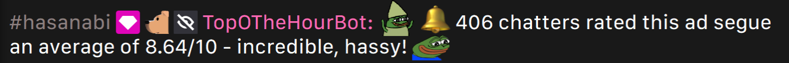

# TopOTheHourBot

TopOTheHourBot is a simple bot that only runs in HasanAbi's chat. It does one thing - that thing being to tally ad segue scores for an average.



The bot reads each incoming chat message searching for "scores" - a fraction whose denominator is 10, written vaguely like "X/10", where "X" is a number between 0 and 10. If a high density of scores can be found within a certain timespan, TopOTheHourBot will send a notification to the channel, telling the average score.

TopOTheHourBot is a partner to the [HasanHub](https://www.hasanhub.com/) project, currently being developed by [chrcit](https://github.com/chrcit). Average scores are sent to a HasanHub database for upcoming features of the website.

## FAQ

### Can I submit multiple scores?

You can, yes. In prior iterations of the bot, you were unable to do so unless you had multiple accounts, but I ultimately decided that it'd be more fun if chatters could fight to skew the average in a certain direction.

### Can I submit a negative score? A score that's greater than 10? A decimal?

Scores outside of the range 0 to 10 (inclusive) are ignored. Decimal values within this range are completely valid, and counted towards the average as normal.

For any nerds reading this: TopOTheHourBot conducts its search using a [regular expression](https://en.wikipedia.org/wiki/Regular_expression). The exact pattern ([in Python flavor](https://docs.python.org/3/library/re.html)) is:

```python
r"""
(?:^|\s)            # should proceed the beginning or whitespace
(
  (?:(?:\d|10)\.?)  # any integer within range 0 to 10
  |
  (?:\d?\.\d+)      # any decimal within range 0 to 9
)
\s?/\s?10           # denominator of 10
(?:$|[\s,.!?])      # should precede the end, whitespace, or some punctuation
"""
```

[You can mess around with this pattern for yourself here](https://regex101.com/r/YyFggX/2).

Example messages that would be contributing a score towards the average:

```
10/10
5 /10
0./10
3.14159265/ 10 some trailing text
.456 / 10
some text 5.5555/10 more text
4/10 this is a lot of text 5/10
```

The *first* score is always the one that's chosen by the bot (in cases where a message contains multiple).

### When does the bot run?

The bot will go online everyday at 2:00 PM Eastern (or, 11:00 AM Pacific in Hasan's time). It goes offline after 9.5 hours.

I will, on some days, manually stop the bot from running if Hasan announces that he won't be streaming. There have also been a rare few instances where the bot had suffered from a connection issue, and is unable to recover until the following day - usually due to a network hiccup, or an expired access token.

### How is the bot ran?

The bot currently runs on a [DigitalOcean Droplet](https://www.digitalocean.com/products/droplets) that simply executes [main.py](main.py) as a [cron job](https://en.wikipedia.org/wiki/Cron).

### Why does the bot chat normally sometimes?

The bot has some commands that are only usable by me and some friends. It used to have a command, called "$shadow", that would route whatever we're saying through the bot, without an indication that the message came from someone else. If you ever saw the bot chatting normally, it was one of us puppeteering it.

Twitch bots are also not like Discord bots - the user who created the bot's account may still login as the bot, and use the account as normal. This hasn't been done since the initial few days of the bot's deployment, however (there was one message sent in Hasan's chat, from me, that was done to test something).

In the past, I've also made small changes to have it reply to some friends under particular conditions.

### Why did the bot not send out a message at [some moment in time]?

Either the bot was offline, or the score density wasn't high enough. TopOTheHourBot used to suffer from server drops, but, Hasan had recently (at the time of writing this) granted it VIP status, which prevents this issue.

If you didn't already know: when a Twitch chat is moving quickly, messages get served in batches (this is why it may appear to move and stop periodically). If you don't send a message while the chat is moving, your message is dropped by the Twitch servers to save on resources. This "drop" [is visualized by Chatterino](https://github.com/Chatterino/chatterino2/issues/1213), but not on the native Twitch web client. The native client "lies" to you by displaying your message on the screen when, in actuality, it may have never been sent.

Again, however, this issue has been nullified by Hasan's decision to make TopOTheHourBot a VIP. Users with the "Broadcaster", "Moderator", or "VIP" designation are given message priority over a standard user.

### Why does the bot not do [this thing] anymore?

I go back-and-forth on ideas a lot. Many things have changed in regard to the bot's message formatting and administrative features. Some things were scrapped for performance reasons (keeping the bot online costs money), and other things simply because I felt like they were no longer prudent.

### Why does the bot have [this name color]?

I change its name color for certain holiday seasons. Its "default" name color is the pink that is offered to all users of Twitch - it's a small homage to a friend in chat.

### Why does the bot not have a bot badge like Fossabot?

The bot badge is a [BetterTTV](https://betterttv.com/) designation that must be assigned by the broadcaster. I'm not going to bother Hasan about giving a bot, that only appears every hour, a crudely designed badge (and please do not do so on my behalf).

### Are my messages kept somewhere?

Your chat messages (the content of the message, the associated username, and the time at which it was sent) are *temporarily* stored to search and extract a score from its content. If a score is found, the number you provided is the only thing that's kept by the bot - everything else is discarded. Messages that do not contain a score are completely irrelevant to the bot, and are discarded in their entirety.

To HasanHub, TopOTheHourBot simply tells it each average score, the time at which they were calculated, and [an ID](https://en.wikipedia.org/wiki/Universally_unique_identifier) that signifies what streaming session they're a part of.

### Is there a log of the bot's messages somewhere?

HasanHub will *potentially* include a record of the bot's scores in the near future, but not its chat messages.

Twitch keeps a log of chat messages for the purpose of moderation. The broadcaster and their moderators may view its record of messages. There exists publicly-accessible logging websites, but, per [Twitch's Developer Agreement](https://www.twitch.tv/p/en/legal/developer-agreement/) (under Additional Terms, Requirements for Specific Features and APIs, Chat):

> Only retain chat logs as necessary for the operation of Your Services or to improve Your Services; **do not do so for the purpose of creating public databases**, or, in general, to collect information about Twitch’s end users.

And thus, I will not be linking any such website here.

## Requirements

The bot was written using Python 3.10. Its only external requirement is [TwitchIO](https://twitchio.dev/en/latest/) (version 2.4.0 at the time of development).

Running the bot for yourself requires a "keys.py" module located within the source directory. In it, you must define a `TWITCH_ACCESS_TOKEN` and `TWITCH_CLIENT_SECRET` variable (both strings). [See here for more details](https://dev.twitch.tv/docs/irc/authenticate-bot/).

The bot additionally requires a `HASANHUB_CLIENT_SECRET` variable, but this can be omitted as long as you remove its import in [bot.py](source/bot.py), and its associated callback routine declared in `TopOTheHourBot.__init__()`.

## Contributing

This personal mini-project has been considered finished for a while, but, if you have ideas on some features that could be added, feel free to open a pull request and/or issue. Be warned, however - I refactor the code a lot.

This bot was made with simplicity in mind - please do not make and/or request a feature that would attract too much attention from users, enable the bot to spam chats, etc. Keep it civil, and obviously within the boundaries of Twitch's Developer Agreement.

## Credit

This bot is *not* directly associated with any other project pertaining to Hasan's ad segues unless it is also disclosed by this document (the HasanHub integration, for example, *is* an actual, recognized part of TopOTheHourBot's system that chrcit and I agreed upon).

[One post to Hasan's subreddit](https://www.reddit.com/r/okbuddyhasan/comments/102k9mu/stream_segways_visualized/) that Hasan thought was tied to TopOTheHourBot is, in reality, not at all a part of this project. This post, and the project it showcases, were made by an independent user who I have no association with. This user also has their own bot in the chat, "Hasanabi_Segways", that serves an identical purpose to TopOTheHourBot, but there exists no connection between the two.

You are entirely free to record and/or use data emitted by TopOTheHourBot without any kind of permission (for logging, analysis, etc.). Referencing TopOTheHourBot's Twitch page, or its GitHub repository, are okay as a means to provide attribution in cases where it is needed or preferred. Bear in mind that the underlying algorithm for *how* TopOTheHourBot searches for scores has changed a lot, and may continue to change without notice. False positives can occur (and have on many occasions) in scenarios where chatters are providing scores for a reason unrelated to ad segues - meaning that its data is somewhat noisy. There is no method of programmatically removing this noise (no method that's easily doable, anyways).
